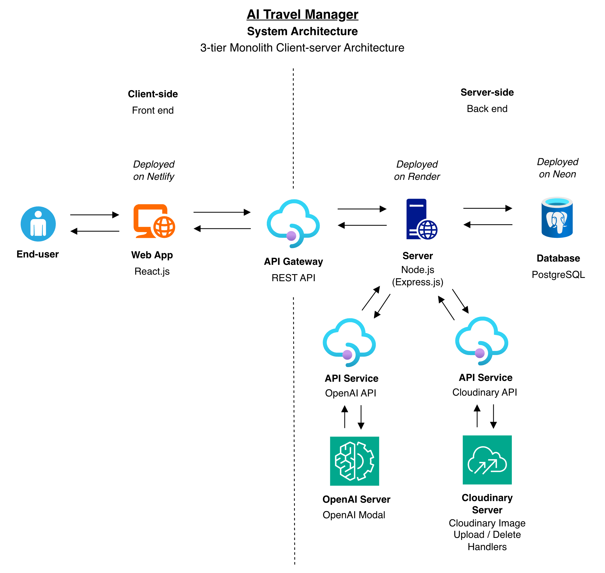

# AI Travel Manager Web App

[](https://app.netlify.com/projects/lucaslhh-travel-manager/deploys) https://lucaslhh-travel-manager.netlify.app</br>

https://ai-travel-manager-web-app.onrender.com</br>

</br>

## 1. Description

An client/server application based on a Node.js + Express API paired with a React + Vite UI for a Travel Product management application.
With full functionality across creating, editing, viewing, and deleting travel products, plus AI features for intelligent search and generating new product listings.

1. **Travel Product Management** - Create, view, update, and delete travel products (destinations, categories, prices, validity dates).
2. **AI Search** - Search for travel products using natural language powered by AI.
3. **AI Product Generation** - Automatically generate details for new travel products based on minimal inputs with OpenAI.
4. **AI Image Generation** - Generate product images with OpenAI.
5. **Image Management** - Upload and delete images to and from Cloudinary.
6. **Data Export** - Export a collection of products to Excel or PDF with a card layout, or export a single product to PDF in a full page view layout.
7. **Dashboard Stats** - View statistics of all travel products.
8. **Responsive UI** - Mobile responsive UI for seamless usage across devices.

## 2. System Architecture

<p align="center">
  <kbd>
    
  </kbd>
</p>
<p align="center">Figure 2.1: System Architecture Diagram</p>

- **Frontend**: React (Vite), Tailwind CSS v4, TanStack Query (React Query), TanStack Table (React Table), `react-hook-form`, `lucide-react`
- **Backend**: Node.js, Express, Prisma ORM, `express-rate-limit`, `zod` schema validation, and OpenAI API integration
- **Database**: PostgreSQL
- **Media Storage**: Cloudinary

## 3. Installation

Requires Node 20+.

```bash
git clone <repo>
cd AI_travel_manager-web_app
```

Install dependencies for both the client and server:

```bash
cd Workspace/server
npm install
cd ../client
npm install
```

Copy the env examples and fill in real values:

```bash
# In Workspace/server
cp .env.example .env
```

Start the PostgreSQL database and API server (via Docker Compose):

```bash
cd Workspace/server
docker-compose up -d
```

*(To stop them, `docker-compose down`)*

Push the database schema to the running database (this will also run the seed script automatically to populate sample travel products):

```bash
npx prisma db push
```

*(If you ever need to run the seed script manually, you can use `npx prisma db seed`)*

*(Alternatively, to run only the database in Docker and the server locally, you can use `docker-compose up db -d` and `npm run dev` in the server directory).*

Run the Client Web App:

```bash
cd Workspace/client
npm run dev    # http://localhost:5173
```

## 4. Usage

### 4.1. Non-functional Features

- **AI Integration** -
    - Leverages OpenAI for product search, generative product creation, and image generation.
- **Security** -
    - Rate limit protection for all API endpoints using `express-rate-limit`.
- **Input Validation** -
    - Frontend input forms are validated with `react-hook-form` and backend requests with `zod`.
- **Backend Accessibility** -
    - The API is locked to one origin point by CORS, which is set to the frontend base URL.
- **Performance & Data Grid** -
    - Frontend data fetching and caching is optimised using TanStack Query (React Query).
    - Complex data tables are handled using TanStack Table (React Table).
- **UI Responsiveness** -
    - The UI components and Tailwind layouts seamlessly handle various screen sizes.

### 4.2. Functional Features

- **Manage Travel Products** -
    - Add new travel products by providing details like destination, category, price, and validity.
    - View a list of all products in a structured table.
    - Update or delete existing products.
- **AI Search** -
    - Use natural language to search and filter products based on AI understanding rather than strict keyword matching.
- **AI Product & Image Generator** -
    - Generate complete product descriptions and details using AI prompts with OpenAI.
    - Generate product images using OpenAI.
- **Image Management** -
    - Upload and delete images to and from Cloudinary.
- **Data Export** -
    - Export a collection of products to Excel or PDF with a card layout.
    - Export a single product to PDF in a full page view layout.
- **Dashboard Statistics** -
    - Get an overview of the number of products in the inventory.

## 5. Source Code Structure

### 5.1. Frontend (Client) Source Code

The `src` directory contains the core frontend application code, structured as follows:

- **`main.tsx`**: The main entry point of the React application that renders `App.tsx` into the DOM.
- **`App.tsx`**: The main React component acting as the root of the application.
- **`global.css`**: The global CSS file where Tailwind CSS directives and custom global styles are defined.
- **`components/`**: Contains reusable React UI components.
- **`services/`**: Contains API service functions for communicating with the backend server.
- **`types/`**: Contains TypeScript type definitions.
- **`constants.ts`**: Contains constant values used throughout the frontend application.

### 5.2. Backend (Server) Source Code

The `src` directory contains the core application logic, structured as follows:

- **`index.ts`**: The main entry point of the server that initializes the Express application and routes.
- **`config/`**: Contains configuration files (e.g. OpenAI and DB setup).
- **`schema/`**: Contains Zod validation schemas.
- **`middleware/`**: Contains Express middlewares (rate limiting, CORS, validation).
- **`routes/`**: Contains Express route definitions.
- **`controllers/`**: Contains route handler functions processing business logic and AI integration.
- **`data/`**: Contains database interaction functions wrapping Prisma calls.
- **`prisma/`**: Contains the `schema.prisma` file defining the database models.

## 6. License -
Copyright (c) 2026 H.V.L.Hasanka<br>
Licensed under [MIT License](LICENSE)
